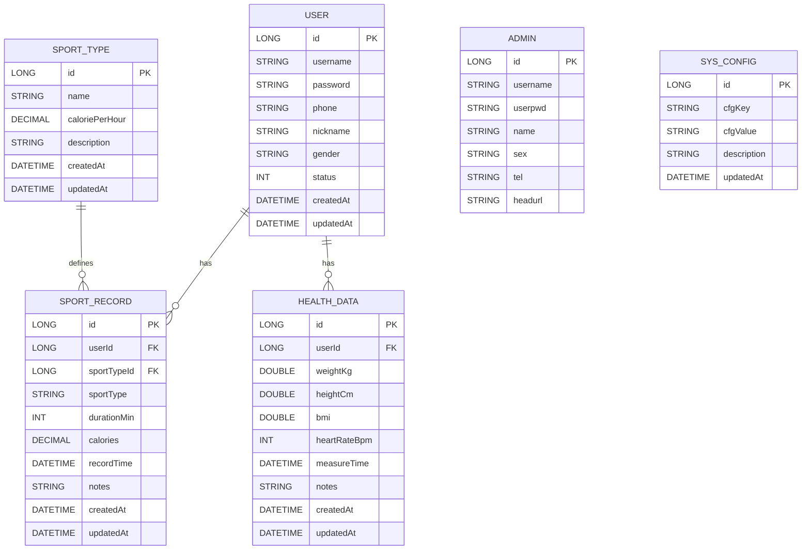
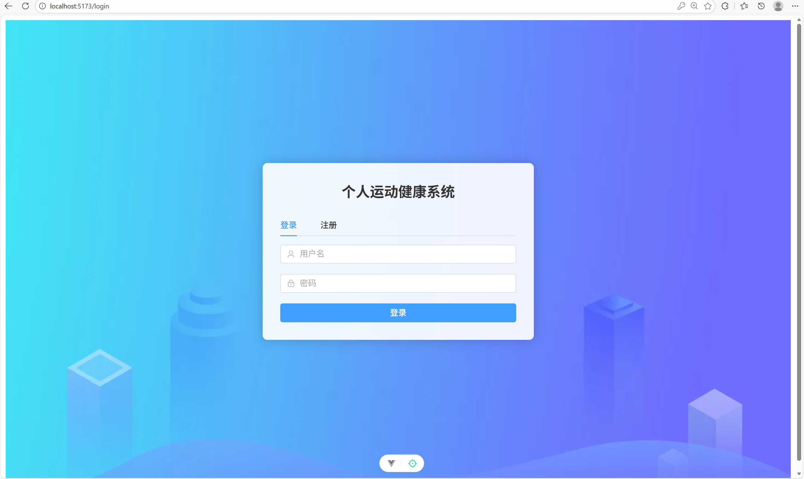
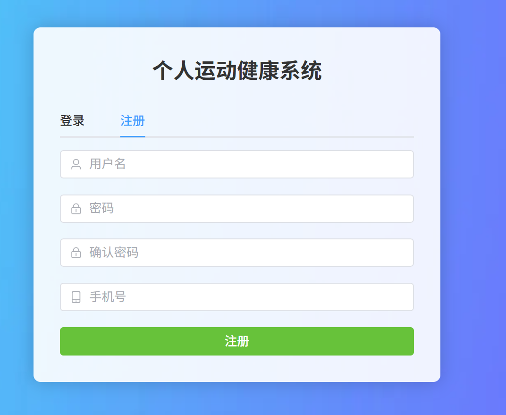
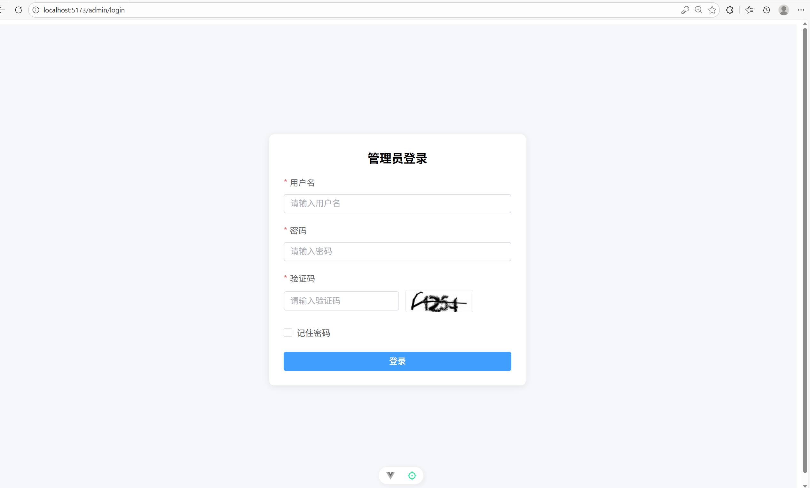
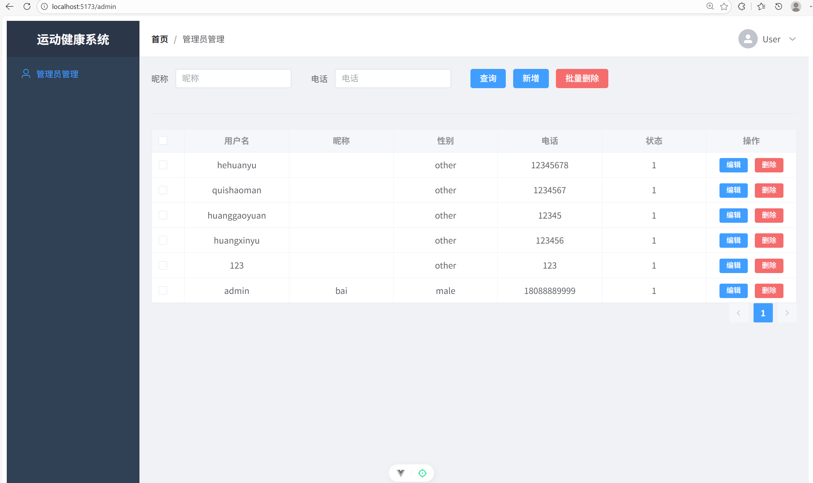
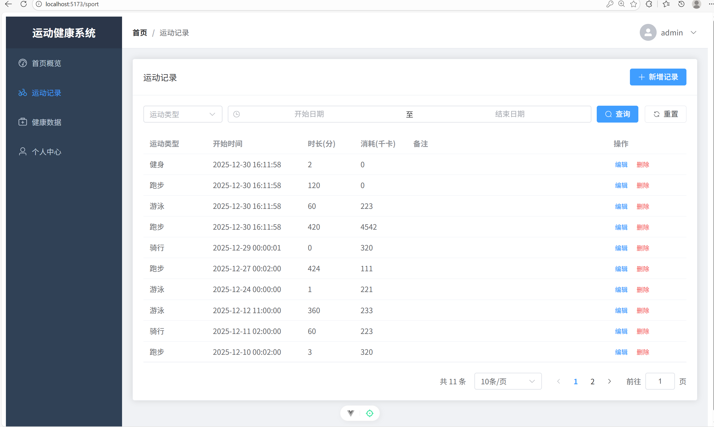
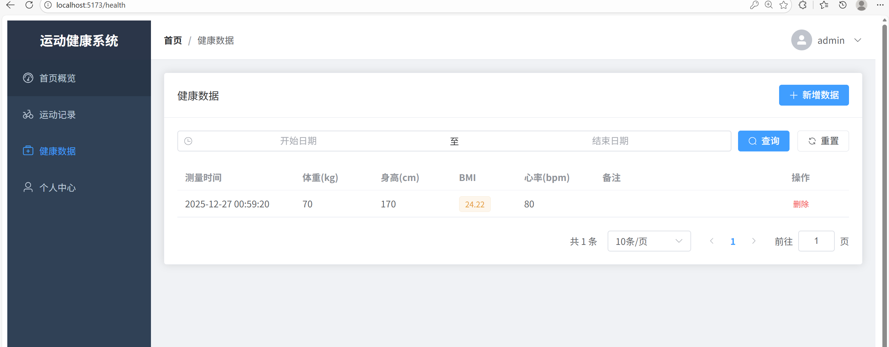
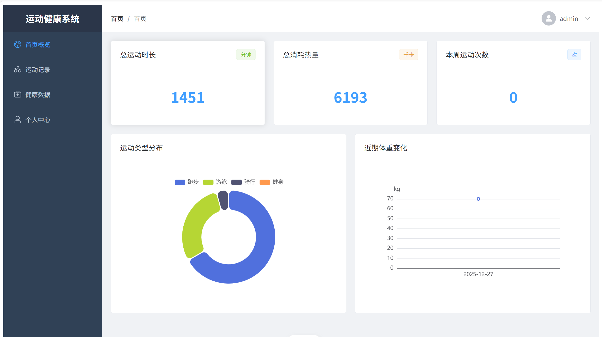

# 个人运动健康系统实验报告

## 1. 小组与分工
- 组长：请填写“姓名（学号）”
- 组员：请填写“姓名（学号）”
- 分工比例：示例“张三 40%，李四 35%，王五 25%”（最低 5%，最高不超过 60%，两人组队单人不超过 70%）

## 2. 系统概述
- 项目位置：根目录下 [pdmadmin](file:///d:/课程文件/数据库/大作业/pdmadmin)（后端）与 [pdmadmin-vue](file:///d:/课程文件/数据库/大作业/pdmadmin-vue)（前端）
- 系统功能：支持用户注册/登录、运动记录管理、健康数据管理、管理员的用户管理、数据统计展示
- 交互窗口：Web 前端（Vue3 + Element Plus），后端接口（Spring Boot 3）

## 3. ER 图（Mermaid）

## 4. 数据表与字段定义
- 管理员表 Admin（参考 [Admin.java](file:///d:/课程文件/数据库/大作业/pdmadmin/src/main/java/com/pdmadmin/pdmadmin/entity/Admin.java)）
  - id BIGINT PK，自增
  - username VARCHAR(64)
  - userpwd VARCHAR(128)
  - name VARCHAR(64)
  - sex VARCHAR(16)
  - tel VARCHAR(32)
  - headurl VARCHAR(255)
- 用户表 User（参考 [User.java](file:///d:/课程文件/数据库/大作业/pdmadmin/src/main/java/com/pdmadmin/pdmadmin/entity/User.java)）
  - id BIGINT PK，自增
  - username VARCHAR(64)，唯一
  - password VARCHAR(128)
  - phone VARCHAR(32)
  - nickname VARCHAR(64)
  - gender VARCHAR(16)
  - status INT
  - createdAt DATETIME
  - updatedAt DATETIME
- 运动记录表 SportRecord（参考 [SportRecord.java](file:///d:/课程文件/数据库/大作业/pdmadmin/src/main/java/com/pdmadmin/pdmadmin/entity/SportRecord.java)）
  - id BIGINT PK，自增
  - userId BIGINT FK -> User.id
  - sportTypeId BIGINT FK -> SportType.id
  - sportType VARCHAR(64)
  - durationMin INT
  - calories DECIMAL(10,2)
  - recordTime DATETIME
  - notes VARCHAR(255)
  - createdAt DATETIME
  - updatedAt DATETIME
- 健康数据表 HealthData（参考 [HealthData.java](file:///d:/课程文件/数据库/大作业/pdmadmin/src/main/java/com/pdmadmin/pdmadmin/entity/HealthData.java)）
  - id BIGINT PK，自增
  - userId BIGINT FK -> User.id
  - weightKg DOUBLE
  - heightCm DOUBLE
  - bmi DOUBLE
  - heartRateBpm INT
  - measureTime DATETIME
  - notes VARCHAR(255)
  - createdAt DATETIME
  - updatedAt DATETIME
- 运动类型表 SportType（参考 [SportType.java](file:///d:/课程文件/数据库/大作业/pdmadmin/src/main/java/com/pdmadmin/pdmadmin/entity/SportType.java)）
  - id BIGINT PK，自增
  - name VARCHAR(64)
  - caloriePerHour DECIMAL(10,2)
  - description VARCHAR(255)
  - createdAt DATETIME
  - updatedAt DATETIME
- 系统配置表 SysConfig（参考 [SysConfig.java](file:///d:/课程文件/数据库/大作业/pdmadmin/src/main/java/com/pdmadmin/pdmadmin/entity/SysConfig.java)）
  - id BIGINT PK，自增
  - cfgKey VARCHAR(64)
  - cfgValue VARCHAR(255)
  - description VARCHAR(255)
  - updatedAt DATETIME

## 5. 交互界面与 CRUD SQL
### 5.1 用户管理（管理员端）
- 界面位置：
  - 列表页：[List.vue](file:///d:/课程文件/数据库/大作业/pdmadmin-vue/src/views/admin/List.vue)
  - 弹窗页：[Addorupdate.vue](file:///d:/课程文件/数据库/大作业/pdmadmin-vue/src/views/admin/Addorupdate.vue)
- 接口位置：
  - 控制器：[AdminController.java](file:///d:/课程文件/数据库/大作业/pdmadmin/src/main/java/com/pdmadmin/pdmadmin/controller/AdminController.java)
- 示例 SQL：
  - 查询（分页+筛选+排序）：
    - SELECT * FROM user WHERE nickname LIKE CONCAT('%', :nickname, '%') AND phone LIKE CONCAT('%', :phone, '%') ORDER BY id DESC LIMIT :pageSize OFFSET (:pageNum-1)*:pageSize;
  - 新增：
    - INSERT INTO user(username, password, phone, nickname, gender, status, createdAt, updatedAt) VALUES(:username, :password, :phone, :nickname, :gender, :status, NOW(), NOW());
  - 修改：
    - UPDATE user SET password=:password, phone=:phone, nickname=:nickname, gender=:gender, status=:status, updatedAt=NOW() WHERE id=:id;
  - 删除（批量）：
    - DELETE FROM user WHERE id IN (:ids);
  - 级联删除说明：
    - 管理员执行批量删除时，后端在事务中先删除用户的健康数据与运动记录，再删除用户数据，确保一致性，参见 [AdminController.java:L93-L107](file:///d:/课程文件/数据库/大作业/pdmadmin/src/main/java/com/pdmadmin/pdmadmin/controller/AdminController.java#L93-L107) 的删除实现。
  - 分页与筛选实现（后端）：
    - 参考 [AdminController.java:L60-L76](file:///d:/课程文件/数据库/大作业/pdmadmin/src/main/java/com/pdmadmin/pdmadmin/controller/AdminController.java#L60-L76)，使用 MyBatis-Plus Page 与 LambdaQueryWrapper 实现分页、按昵称与电话模糊筛选、按主键倒序。

### 5.2 运动记录
- 界面位置：[sport/List.vue](file:///d:/课程文件/数据库/大作业/pdmadmin-vue/src/views/sport/List.vue)
- 接口位置：[SportRecordController.java](file:///d:/课程文件/数据库/大作业/pdmadmin/src/main/java/com/pdmadmin/pdmadmin/controller/SportRecordController.java)
- 示例 SQL：
  - 查询（时间范围、类型筛选、分页）：
    - SELECT * FROM sport_record WHERE user_id=:uid AND (:startDate IS NULL OR record_time >= :startDate) AND (:endDate IS NULL OR record_time <= :endDate) AND (:sportTypeId IS NULL OR sport_type_id=:sportTypeId) ORDER BY record_time DESC LIMIT :pageSize OFFSET (:pageNum-1)*:pageSize;
  - 新增：
    - INSERT INTO sport_record(user_id, sport_type_id, sport_type, duration_min, calories, record_time, notes, created_at, updated_at) VALUES(:uid, :sportTypeId, :sportType, :durationMin, :calories, :recordTime, :notes, NOW(), NOW());
  - 修改：
    - UPDATE sport_record SET sport_type_id=:sportTypeId, sport_type=:sportType, duration_min=:durationMin, calories=:calories, record_time=:recordTime, notes=:notes, updated_at=NOW() WHERE id=:id AND user_id=:uid;
  - 删除：
    - DELETE FROM sport_record WHERE id=:id AND user_id=:uid;
 - 分页与筛选实现（后端）：
   - 参考 [SportRecordController.java:L63-L83](file:///d:/课程文件/数据库/大作业/pdmadmin/src/main/java/com/pdmadmin/pdmadmin/controller/SportRecordController.java#L63-L83)，按登录用户筛选，支持 sportTypeId 与时间范围筛选，按 recordTime 倒序分页。

### 5.3 健康数据
- 界面位置：[health/List.vue](file:///d:/课程文件/数据库/大作业/pdmadmin-vue/src/views/health/List.vue)
- 接口位置：[HealthDataController.java](file:///d:/课程文件/数据库/大作业/pdmadmin/src/main/java/com/pdmadmin/pdmadmin/controller/HealthDataController.java)
- 示例 SQL：
  - 查询（时间范围筛选、分页）：
    - SELECT * FROM health_data WHERE user_id=:uid AND (:startDate IS NULL OR measure_time >= :startDate) AND (:endDate IS NULL OR measure_time <= :endDate) ORDER BY measure_time DESC LIMIT :pageSize OFFSET (:pageNum-1)*:pageSize;
  - 新增：
    - INSERT INTO health_data(user_id, weight_kg, height_cm, bmi, heart_rate_bpm, measure_time, notes, created_at, updated_at) VALUES(:uid, :weightKg, :heightCm, :bmi, :heartRateBpm, :measureTime, :notes, NOW(), NOW());
  - 删除：
    - DELETE FROM health_data WHERE id=:id AND user_id=:uid;
 - 分页与筛选实现（后端）：
   - 参考 [HealthDataController.java:L54-L72](file:///d:/课程文件/数据库/大作业/pdmadmin/src/main/java/com/pdmadmin/pdmadmin/controller/HealthDataController.java#L54-L72)，按登录用户与时间范围筛选，按 measureTime 倒序分页。

### 5.4 用户认证（普通用户）
- 界面位置：[Login.vue](file:///d:/课程文件/数据库/大作业/pdmadmin-vue/src/views/Login.vue)
- 接口位置：[AuthController.java](file:///d:/课程文件/数据库/大作业/pdmadmin/src/main/java/com/pdmadmin/pdmadmin/controller/AuthController.java)
- 示例 SQL：
  - 注册：
    - INSERT INTO user(username, password, phone, nickname, status, created_at, updated_at) VALUES(:username, :password, :phone, :nickname, 1, NOW(), NOW());
  - 登录（校验）：
    - SELECT * FROM user WHERE username=:username AND password=:password;
 - 登录会话与角色：
   - 成功登录后保存 token 与用户信息到 localStorage，并设置 login_role 为 user，参见前端 [Login.vue](file:///d:/课程文件/数据库/大作业/pdmadmin-vue/src/views/Login.vue#L88-L96)。

### 5.5 管理员认证
- 界面位置：[AdminLogin.vue](file:///d:/课程文件/数据库/大作业/pdmadmin-vue/src/views/admin/AdminLogin.vue)
- 接口位置：[AdminController.java](file:///d:/课程文件/数据库/大作业/pdmadmin/src/main/java/com/pdmadmin/pdmadmin/controller/AdminController.java)
- 示例 SQL：
  - 登录（校验）：
    - SELECT * FROM admin WHERE username=:username AND userpwd=:userpwd;
 - 验证码校验与会话：
   - 登录需先通过验证码校验，成功后创建会话并返回 token，参见 [AdminController.java:L119-L140](file:///d:/课程文件/数据库/大作业/pdmadmin/src/main/java/com/pdmadmin/pdmadmin/controller/AdminController.java#L119-L140)。前端登录成功后设置 login_role 为 admin，参见 [AdminLogin.vue](file:///d:/课程文件/数据库/大作业/pdmadmin-vue/src/views/admin/AdminLogin.vue#L95-L101)。

## 6. 排序、筛选与分页
- 排序：列表均提供按时间或主键倒序，如 record_time DESC、measure_time DESC、id DESC
- 筛选：运动记录、健康数据支持时间范围筛选；用户管理支持昵称、电话筛选
- 分页：所有列表接口使用 LIMIT + OFFSET 或 MyBatis-Plus Page 实现后端分页
- 分页插件：后端启用 MyBatis-Plus 分页拦截器，参见 [MybatisPlusConfig.java:L10-L15](file:///d:/课程文件/数据库/大作业/pdmadmin/src/main/java/com/pdmadmin/pdmadmin/config/MybatisPlusConfig.java#L10-L15)。

## 7. 统计功能（GROUP BY）
- 接口位置：[StatController.java](file:///d:/课程文件/数据库/大作业/pdmadmin/src/main/java/com/pdmadmin/pdmadmin/controller/StatController.java)
- 示例 SQL：
  - 总消耗与时长：
    - SELECT IFNULL(SUM(duration_min),0) AS totalDuration, IFNULL(SUM(calories),0) AS totalCalories FROM sport_record WHERE user_id=:uid;
  - 按类型聚合：
    - SELECT sport_type AS typeName, SUM(duration_min) AS totalDuration, SUM(calories) AS totalCalories FROM sport_record WHERE user_id=:uid GROUP BY sport_type;
 - 代码实现参考：
   - 概览统计：[StatController.java:L27-L39](file:///d:/课程文件/数据库/大作业/pdmadmin/src/main/java/com/pdmadmin/pdmadmin/controller/StatController.java#L27-L39)
   - 类型聚合：[StatController.java:L41-L53](file:///d:/课程文件/数据库/大作业/pdmadmin/src/main/java/com/pdmadmin/pdmadmin/controller/StatController.java#L41-L53)

## 8. 事务设计
- 建议在以下场景使用事务（@Transactional）：
  - 管理员批量删除用户时，同时删除用户的运动记录与健康数据，避免部分删除导致数据不一致
  - 用户提交健康数据或运动记录时，同时写入统计表（若有），确保一致性
- 不添加事务可能导致的问题：
  - 批量操作中途失败产生“半更新”状态，用户数据与关联记录不一致
 - 本项目实现：
   - 管理员批量删除用户的接口已使用事务并实现级联删除，详见 [AdminController.java:L93-L107](file:///d:/课程文件/数据库/大作业/pdmadmin/src/main/java/com/pdmadmin/pdmadmin/controller/AdminController.java#L93-L107)。

## 9. 权限与角色控制
- 前端控制：
  - 登录角色通过 localStorage 的 login_role 标记，管理员为 admin，普通用户为 user。
  - 路由守卫禁止普通用户访问 /admin，参见 [router/index.ts:L63-L88](file:///d:/课程文件/数据库/大作业/pdmadmin-vue/src/router/index.ts#L63-L88)。
  - 管理员登录后仅显示“管理员管理”菜单，普通用户隐藏该菜单，参见 [Index.vue](file:///d:/课程文件/数据库/大作业/pdmadmin-vue/src/views/Index.vue)。
- 后端控制：
  - 所有 /admin 下的用户 CRUD 接口在执行前校验当前登录是否为管理员，非管理员返回“无权操作”，参见 [AdminController.java](file:///d:/课程文件/数据库/大作业/pdmadmin/src/main/java/com/pdmadmin/pdmadmin/controller/AdminController.java).

## 10. 界面截图与说明
- 截图建议从以下页面采集并附在报告：
  - 用户登录/注册页：[Login.vue](file:///d:/课程文件/数据库/大作业/pdmadmin-vue/src/views/Login.vue)
  
  
  - 管理员登录页：[AdminLogin.vue](file:///d:/课程文件/数据库/大作业/pdmadmin-vue/src/views/admin/AdminLogin.vue)
  
  - 管理员用户管理列表与弹窗：[List.vue](file:///d:/课程文件/数据库/大作业/pdmadmin-vue/src/views/admin/List.vue)、[Addorupdate.vue](file:///d:/课程文件/数据库/大作业/pdmadmin-vue/src/views/admin/Addorupdate.vue)
  
  
  - 运动记录列表：[sport/List.vue](file:///d:/课程文件/数据库/大作业/pdmadmin-vue/src/views/sport/List.vue)
  
  - 健康数据列表：[health/List.vue](file:///d:/课程文件/数据库/大作业/pdmadmin-vue/src/views/health/List.vue)
  
  - 仪表盘统计页面（如有）：[dashboard/Index.vue](file:///d:/课程文件/数据库/大作业/pdmadmin-vue/src/views/dashboard/Index.vue)
  

## 11. 代码定位与演示说明
- 认证逻辑：后端 [AuthController.java](file:///d:/课程文件/数据库/大作业/pdmadmin/src/main/java/com/pdmadmin/pdmadmin/controller/AuthController.java)、[AdminController.java](file:///d:/课程文件/数据库/大作业/pdmadmin/src/main/java/com/pdmadmin/pdmadmin/controller/AdminController.java)
- 业务 CRUD：后端各 Controller 与 Service；前端各模块视图与 API
- 现场演示建议：
  - 先登录用户，演示运动与健康数据的增删改查与筛选、分页
  - 再登录管理员，演示对用户表的增删改查与权限控制
  - 展示统计接口效果（总计与按类型聚合）

## 12. 高分要求达成说明
- 统计功能（GROUP BY）：已实现总览与按类型聚合，参见 [StatController.java](file:///d:/课程文件/数据库/大作业/pdmadmin/src/main/java/com/pdmadmin/pdmadmin/controller/StatController.java)。
- 分页查询（后端分页）：各列表接口统一使用 MyBatis-Plus Page，参见 [AdminController.java:L60-L76](file:///d:/课程文件/数据库/大作业/pdmadmin/src/main/java/com/pdmadmin/pdmadmin/controller/AdminController.java#L60-L76)、[SportRecordController.java:L63-L83](file:///d:/课程文件/数据库/大作业/pdmadmin/src/main/java/com/pdmadmin/pdmadmin/controller/SportRecordController.java#L63-L83)、[HealthDataController.java:L54-L72](file:///d:/课程文件/数据库/大作业/pdmadmin/src/main/java/com/pdmadmin/pdmadmin/controller/HealthDataController.java#L54-L72)。
- 前端载体与交互：Web 前端使用 Vue3 + Element Plus，界面美观且交互合理。
- 事务支持：管理员批量删除使用事务确保级联一致性，参见 [AdminController.java:L93-L107](file:///d:/课程文件/数据库/大作业/pdmadmin/src/main/java/com/pdmadmin/pdmadmin/controller/AdminController.java#L93-L107)。
- 报告内容：包含 ER 图、数据表字段、各功能 SQL 与界面截图、事务章节与权限控制说明。
